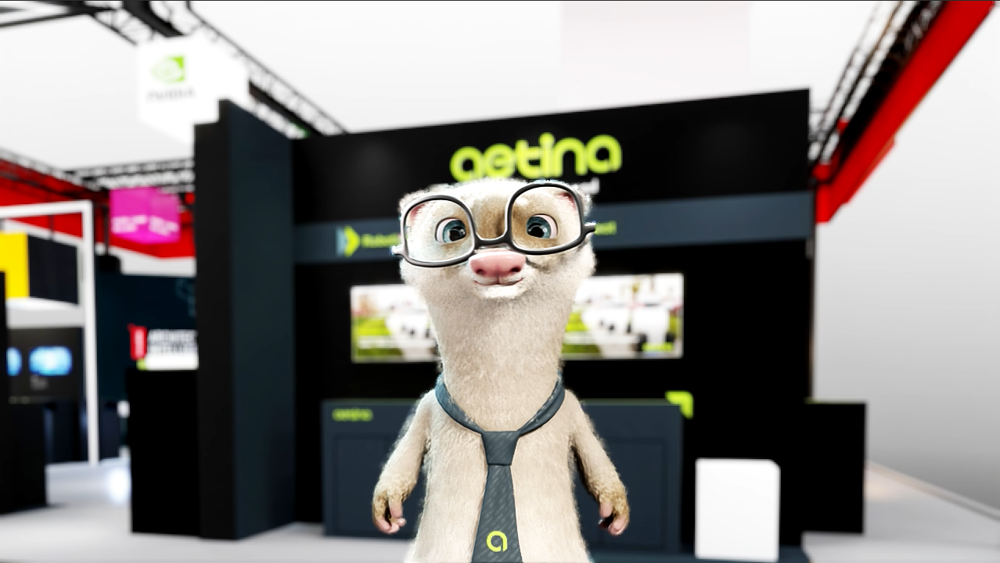
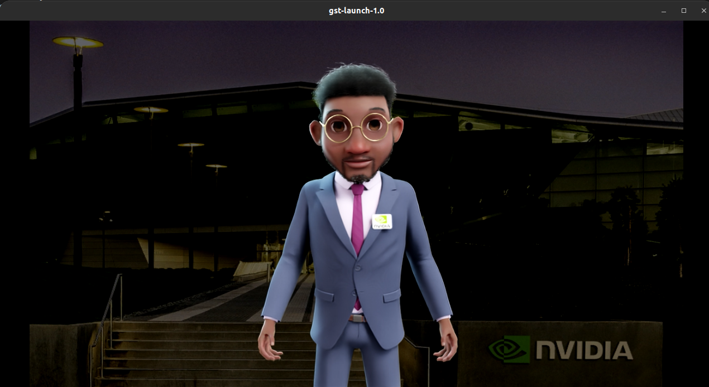
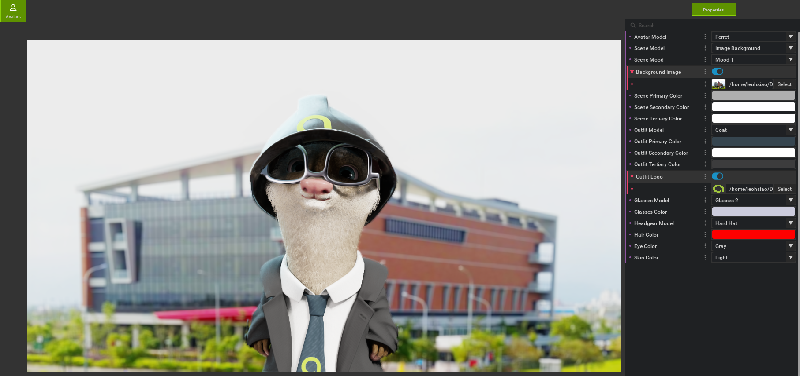

## 前言
在Computex2025和2026，安提有展出Digital Human搭配機器手臂的互動應用，其中的Digital Human是採用NVIDIA的Animation Pipeline workflow實做的。

這篇文章會介紹該如何使用這套方案，從推薦設備、環境配置到控制Digital Avatar的動作和外觀，方便有興趣的人參考。

下一篇則會介紹如何將 Audio2Face（A2F）等語音轉表情的技術串接到這個 Digital Human 上，讓他可以開口講話。

## NVIDIA Digital Avatar介紹
展場中我們所使用的Digital Avatar是由NVIDIA所提供的Animation Pipeline workflow，通過此流程我們可以將NVIDIA提供的3D模型，加入動作、手勢、嘴型、表情和講話等，將3D模型打造成一個可以互動的Digital Avatar。

且NVIDIA有提供一個簡易的Digital Avatar編輯工具，可以讓使用者低門檻的去更改Avatar的外觀造型，快速打造屬於自己的Digital Avatar。



## 建議設備

> ⚠️ 此專案NVIDIA已經Deprecated了，因此很多新架構的GPU新版本顯卡驅動都會遇到無法支援或是運行中會遇到錯誤的情況。
> https://archive.docs.nvidia.com/ace/tokkio/5.0/overview/overview.html

我們先看官方的Digital Avatar的Deployment requirements

### 官方建議規格

---
#### Supported Platforms

- CPU: x86 compatible

- Linux (e.g. Ubuntu 22.04)


#### Hardware Requirements
| 硬體元件 | 📉 最低系統配備 (Minimum) | 🚀 推薦系統配置 (Recommended) |
| :--- | :--- | :--- |
| **儲存空間** | **5 GB** 可用空間 (建議為 **SSD** 固態硬碟) | **5 GB** 可用空間 (建議為 **SSD** 固態硬碟) |
| **中央處理器 (CPU)** | **12 核心** (12 cores) 以上處理器 | **16 核心** (16 cores) 以上處理器 |
| **系統記憶體 (RAM)**| **24 GB** 以上可用系統記憶體 | **32 GB** 以上可用系統記憶體 |
| **顯示卡 (GPU)** | 1 張 **NVIDIA RTX 階級相容** 顯示卡 | 1 張 **NVIDIA RTX 階級相容** 顯示卡 |
| **顯示記憶體 (VRAM)**| **8 GB** 以上顯示記憶體 | **12 GB** 以上顯示記憶體 |

#### Deployment requirements

- RTX-compatible GPU (e.g. RTX 3080, RTX 3090, RTX 6000, A10, A40, etc.)

- The GPU requirement depend on the scene complexity (meshes, textures, lights, etc.)

- The Tesla T4 GPU is at the lower performance bound, but it may work for some scenes.

#### Known Issues / Limitations
NVIDIA driver version 545 is currently not supported. We recommend driver version 535.

DLSS frame generation has been disabled due to renderer stalls. Thus, this microservice cannot benefit from the DLSS frame generation performance improvements available on Ada GPUs and newer generations. This will be addressed in a future version.

以上資料取自 [Omniverse Renderer - USC README](https://archive.docs.nvidia.com/ace/omniverse-renderer-microservice/1.1/ucs-ms/README.html)

---

### 實測心得

根據我們的實測，可使用的顯卡還有以下規律

GPU Compute Capability >= 7.5 <=8.9 的顯卡，才可以跑起來。
顯卡的Compute Capability可以參考NVIDIA官方的[CUDA GPU Compute Capability](https://developer.nvidia.com/cuda/gpus)查詢。

RTX的顯卡不是剛需，若是不介意較差的渲染效果和卡頓和Glitch等情況 ，L4 L40S等Data Center GPU也可以跑起來。

官方建議顯卡驅動版本為535，但經過實測 590版本確定無法運行，580版本還可以正常跑起來。

### 我們使用的設備
| 硬體元件 | 規格 |
| :--- | :--- |
| **中央處理器 (CPU)** | Intel Core i5-14500 |
| **系統記憶體 (RAM)** | 32 GB |
| **顯示卡 (GPU)** | NVIDIA RTX 3060Ti + NVIDIA RTX 2080|
| **顯示記憶體 (VRAM)** | 8 GB + 8GB |
| **儲存空間** | 512 GB NVMe SSD |

NVIDIA RTX 3060Ti負責跑Omniverse Renderer + Animation Pipeline。
NVIDIA RTX 2080負責跑Audio2Face，這個是Digital Human中重要的另一個部份，下篇文章中會介紹。

---


## 如何跑起來

### nvcr.io 登入
1. 先到NVIDIA官方網站註冊帳號，並登入NVIDIA NGC
2. 進入 [NVIDIA NGC API KEY](https://org.ngc.nvidia.com/account/api-keys) 頁面，點擊 **Generate Personal Key** 生成一組新的API Key，並將其複製下來。
3. 在終端機中輸入以下指令，在docker中登入NVIDIA NGC：
```bash
docker login nvcr.io


Username: $oauthtoken
Password: <Your Key>
```
### 抓取container

```bash
docker pull nvcr.io/nvidia/ace/ia-animation-graph-microservice:1.1.0
docker pull nvcr.io/nvidia/ace/ia-omniverse-renderer-microservice:1.1.0
docker pull nvcr.io/nim/nvidia/audio2face-3d:1.2
```

### 下載Avatar Scene
[Default Avatar Scene](https://registry.ngc.nvidia.com/orgs/nvidia/teams/ace/resources/default-avatar-scene)
左上角點擊 **Download**，下載Default Avatar Scene，解壓縮後放在資料夾中。


### 運行container

#### Animation Graph Microservice

> 💡 指令中的 `$(pwd)` 代表「目前所在資料夾的路徑」，記得先 `cd` 到剛剛解壓縮 Avatar Scene 的資料夾底下，再執行以下指令。

```bash
docker run -it --rm --gpus all --network=host --name anim-graph-ms -v $(pwd)/default-avatar-scene_v1.1.5:/home/interactive-avatar/asset nvcr.io/nvidia/ace/ia-animation-graph-microservice:1.1.0
```

> ✅ 終端機log中看到 `[11.242s] app ready` 這行，就代表 Animation Graph Microservice 已經啟動成功。

#### Omniverse Renderer Microservice

> 💡 一樣是同一個資料夾底下執行，`$(pwd)` 抓到的就是這個路徑。

```bash
docker run --env IAORMS_RTP_NEGOTIATION_HOST_MOCKING_ENABLED=true --rm --gpus all --network=host --name renderer-ms -v $(pwd)/default-avatar-scene_v1.1.5:/home/interactive-avatar/asset nvcr.io/nvidia/ace/ia-omniverse-renderer-microservice:1.1.0
```

> ✅ 終端機log中看到 `[SceneLoader] Assets loaded.` 這行，就代表 Omniverse Renderer Microservice 已經啟動成功。

### Setup and Start Gstreamer
#### 安裝Gstreamer
```bash
sudo apt-get install gstreamer1.0-plugins-bad gstreamer1.0-libav
```

### 設定stream_id開始串流
```bash
stream_id=$(uuidgen)
curl -X POST -s http://localhost:8020/streams/$stream_id
curl -X POST -s http://localhost:8021/streams/$stream_id
```


#### 播放影像
```bash
gst-launch-1.0 -v udpsrc port=9020 caps="application/x-rtp" ! rtpjitterbuffer drop-on-latency=true latency=20 ! rtph264depay ! h264parse ! avdec_h264 ! videoconvert ! queue ! autovideosink sync=false
```

#### 播放聲音
```bash
gst-launch-1.0 -v udpsrc port=9021 caps="application/x-rtp,clock-rate=16000" ! rtpjitterbuffer ! rtpL16depay ! audioconvert ! autoaudiosink sync=false
```


## 如何更改動作


### 移動位置

```bash
curl -X PUT -s http://localhost:8020/streams/$stream_id/animation_graphs/avatar/variables/position_state/$PositionState

```
| PositionState | 說明 |
| :--- | :--- |
| "Right" | 移動到Avatar的右邊 |
| "Center" | 移動到Avatar的中間 |
| "Left" | 移動到Avatar的左邊 |

### 改變手勢

```bash
curl -X PUT -s http://localhost:8020/streams/$stream_id/animation_graphs/avatar/variables/gesture_state/$GestureState
```

手勢總共有 70 幾種，這邊列幾個比較有意思的給大家參考：

| GestureState | 說明 |
| :--- | :--- |
| "Bowing_1" | 鞠躬 |
| "Pointing_To_User_1" | 指向使用者 |
| "Fistbump_Offer" | 拳頭碰拳 |
| "Thumbs_Up" | 比讚 |
| "Chefs_Kiss" | 廚師之吻（比出完美手勢） |
| "none" | 中斷目前的手勢，回到當前狀態的待機動作 |

完整手勢列表可以參考 [NVIDIA 官方文件](https://archive.docs.nvidia.com/ace/animation-graph-microservice/1.1/default-animation-graph.html)。

### 改變狀態

`posture_state` 控制的是會持續維持的行為狀態，直到你切換到下一個狀態為止：

```bash
curl -X PUT -s http://localhost:8020/streams/$stream_id/animation_graphs/avatar/variables/posture_state/$PostureState
```

| PostureState | 說明 |
| :--- | :--- |
| "Idle" | 待機 |
| "Listening" | 聆聽 |
| "Talking" | 講話中 |
| "Attentive" | 專注 |
| "Thinking" | 思考中 |

### 改變表情

除了手勢和狀態，臉部表情也是獨立的變數 `facial_gesture_state`，會疊加在目前的狀態表情上：

```bash
curl -X PUT -s http://localhost:8020/streams/$stream_id/animation_graphs/avatar/variables/facial_gesture_state/$FacialGestureState
```

表情總共有 60 幾種，一樣列幾個比較有意思的：

| FacialGestureState | 說明 |
| :--- | :--- |
| "Smile" | 微笑 |
| "Excited" | 興奮 |
| "Wink" | 眨眼 |
| "Confused" | 疑惑 |
| "Eye_Roll" | 翻白眼 |

完整表情列表一樣可以到上面的官方文件查看。

## 如何更改外觀

Nvidia有提供[Avatar Configurator](https://archive.docs.nvidia.com/ace/omniverse-renderer-microservice/1.1/avatar-customization/avatar-configurator.html#avatar-configurator)，讓大家可以快速調整Avatar的外觀，像是衣服、帽子、髮型、膚色、眼睛顏色等。

### 安裝Avatar Configurator

#### 下載Avatar Configurator
[Avatar Configurator NGC](https://catalog.ngc.nvidia.com/orgs/nvidia/ace/resources/avatar-configurator-ov/1.1.0-lin/file-browser?_lr=1)
選擇Windows/Linux版本安裝

#### 啟動Avatar Configurator
for Linux:
```bash
cd avatar_configurator
sudo chmod +x ./run_avatar_configurator.sh
./run_avatar_configurator.sh
```
for Windows:
```bash
cd avatar_configurator
.\run_avatar_configurator.bat
```

#### 界面展示


畫面中為可以調整的Avatar外觀選項，像是衣服、帽子、髮型、膚色、眼睛顏色等。 其中衣服的Logo背景圖片等都是可以自己上傳的，這樣就可以打造出屬於自己的Avatar。

完成後點擊右下角的 **Save Scene**，就會將Avatar的外觀設定匯出 **exported** 資料夾中，位置在 `avatar_configurator/exported/`，這個就是Avatar的設定。

將 Container 啟動指令中的 `-v $(pwd)/default-avatar-scene_v1.1.5:/home/interactive-avatar/asset` 換成 `-v $(pwd)/exported:/home/interactive-avatar/asset`——也就是把原本指向 Default Avatar Scene 的路徑，換成剛剛匯出的 `exported` 資料夾，執行起來後就可以看到自己設定的 Avatar 外觀了。

## Github 釋出

## 參考資料
[Nvidia Animation Pipeline](https://archive.docs.nvidia.com/ace/animation-pipeline/1.1/index.html)


[Nvidia Omniverse Renderer](https://archive.docs.nvidia.com/ace/omniverse-renderer-microservice/1.1/)


[CUDA GPU Compute Capability](https://developer.nvidia.com/cuda/gpus)


[NVIDIA Default Animation Graph](https://archive.docs.nvidia.com/ace/animation-graph-microservice/1.1/default-animation-graph.html)
